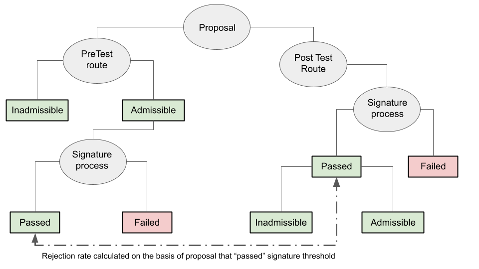

Welcome to the rejection analysis web page. We will house the ongoing analysis and summaries on this webpage.

This webpage will be updated as the analysis proceeds.
  

## Country Reports
Follow these links to access the Country reports

1. Agenda initiatives <a href="https://fmendez72.github.io/lidd/Liddpages/ConceptualMap.html" target="_blank">[access reports]</a>

2. Proactive initiatives <a href="https://fmendez72.github.io/lidd/Liddpages/ConceptualMap.html" target="_blank">[access reports]</a>   

3. Rejective initiatives <a href="https://fmendez72.github.io/lidd/Liddpages/ConceptualMap.html" target="_blank">[access reports]</a>

## Overall conceptualisation
Lorem ipsum dolor sit amet, consectetur adipiscing elit, sed do eiusmod tempor incididunt ut labore et dolore magna aliqua. Ut enim ad minim veniam, quis nostrud exercitation ullamco laboris nisi ut aliquip ex ea commodo consequat. Sed do eiusmod tempor incididunt ut labore et dolore magna aliqua.
  

<a href = "https://fmendez72.github.io/lidd/">
{width=50%}</a>
  

## Core hypotheses
1. Lorem ipsum dolor sit amet  
2. Consectetur adipiscing elit. 
3. Sed do eiusmod tempor incididunt ut labore et dolore magna aliqua. Ut enim ad minim veniam, quis nostrud exercitation ullamco laboris nisi ut aliquip ex ea commodo consequat.  
4. Sed do eiusmod tempor incididunt ut labore et dolore magna aliqua.

  

## Resources and Links

1. Here is an example of a link to a webpage of our own <a href="https://fmendez72.github.io/lidd/Liddpages/ConceptualMap.html" target="_blank">[see link]</a>

2. Here is an example of an external link to the <a href="https://www.constituteproject.org/search?lang=en" target="_blank">Constitute Project</a> database, which has all country constitutions in English.   

3. Lorem ipsum dolor sit amet, consectetur adipiscing elit, sed do eiusmod tempor incididunt ut labore et dolore magna aliqua. 

4. Ut enim ad minim veniam, quis nostrud exercitation ullamco laboris nisi ut aliquip ex ea commodo consequat.
